# BÁO CÁO THỰC HÀNH — MYSQL MASTER–REPLICA REPLICATION

**Môn học:** Hệ Quản trị Cơ sở Dữ liệu  
**Người thực hiện:** Nguyễn Hùng Sơn  
**Nội dung phụ trách:** Triển khai và kiểm thử nhân bản dữ liệu MySQL theo mô hình **1 Master (Source) — 2 Replicas**  
**Môi trường:** Windows PowerShell, Docker Desktop, MySQL 8.4, Python  
**Nguồn kết quả:** Ảnh chụp `evidences/1.png`–`evidences/21.png` và các file trạng thái/log/kết quả cùng thư mục.

## 1. Mục tiêu và phạm vi thực nghiệm

Thực hành thiết lập ba máy chủ MySQL dưới dạng Docker container; cấu hình binary log, tài khoản replication và kết nối hai Replica; kiểm tra đồng bộ cấu trúc và dữ liệu; thử nghiệm INSERT/UPDATE/DELETE; dừng rồi khởi động lại Replica 1 để đánh giá khả năng nhận bù dữ liệu; sinh 10.000 sinh viên giả lập; đối chiếu dữ liệu sau đồng bộ; và đo độ trễ quan sát được khi ghi lên Master.

Đây là **báo cáo các thao tác và kết quả thực nghiệm đã ghi nhận**, không phải tài liệu hướng dẫn cài đặt Cluster. Phần Cluster do thành viên khác trong nhóm thực hiện.

### 1.1. Mô hình triển khai

```text
                     Thao tác ghi (INSERT/UPDATE/DELETE)
                                    |
                                    v
                          mysql-master:3307
                             server-id = 1
                                    |
                               Binary Log
                             /             \
                            v               v
                 mysql-replica1:3308   mysql-replica2:3309
                    server-id = 2         server-id = 3
```

| Thành phần | Docker container | Cổng trên máy host | Cổng nội bộ | `server-id` |
|---|---|---:|---:|---:|
| Master / Source | `mysql-master` | `3307` | `3306` | `1` |
| Replica 1 | `mysql-replica1` | `3308` | `3306` | `2` |
| Replica 2 | `mysql-replica2` | `3309` | `3306` | `3` |

Cấu hình được lưu trong [`docker-compose.yml`](docker-compose.yml); dữ liệu từng node lưu ở Docker named volumes. Mã thử nghiệm nằm trong [`scripts/`](scripts/), lược đồ CSDL trong [`sql/schema.sql`](sql/schema.sql).

## 2. Triển khai Docker và kiểm tra cấu hình

### 2.1. Khởi động ba MySQL container

**Lệnh đã sử dụng (PowerShell):**

```powershell
docker compose up -d
docker compose ps
```

**Kết quả:** `mysql-master`, `mysql-replica1` và `mysql-replica2` đều có trạng thái `Up`; các cổng host lần lượt là `3307`, `3308`, `3309`.

**Minh chứng:** [`evidences/1.png`](evidences/1.png)

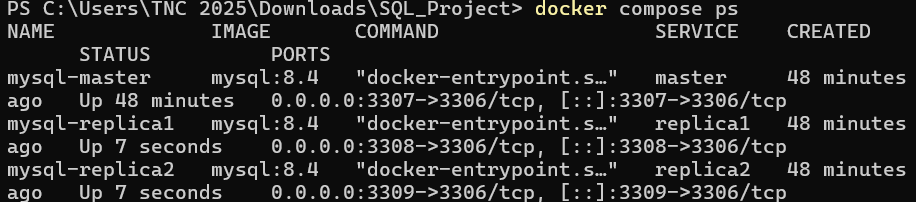

### 2.2. Xác nhận `server-id` và binary logging

**Các lệnh đã thực hiện:**

```powershell
docker exec mysql-master mysql -uroot -proot123 -e "SELECT @@server_id, @@log_bin;"
docker exec mysql-replica1 mysql -uroot -proot123 -e "SELECT @@server_id, @@log_bin;"
docker exec mysql-replica2 mysql -uroot -proot123 -e "SELECT @@server_id, @@log_bin;"
```

**Kết quả:**

| Node | `@@server_id` | `@@log_bin` |
|---|---:|---:|
| Master | 1 | 1 |
| Replica 1 | 2 | 1 |
| Replica 2 | 3 | 1 |

Ba node có `server-id` khác nhau và đều bật binary logging.

**Minh chứng:** [`evidences/2.png`](evidences/2.png)

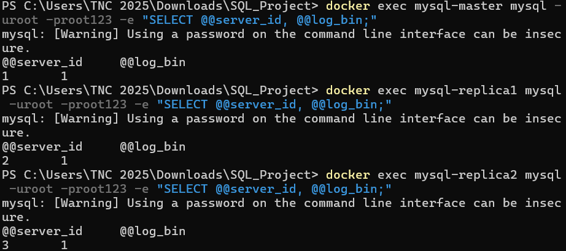

## 3. Thiết lập tài khoản và kết nối replication

### 3.1. Tạo tài khoản nhân bản trên Master

**Lệnh truy cập Master:**

```powershell
docker exec -it mysql-master mysql -uroot -proot123
```

**Các câu lệnh SQL đã thực hiện:**

```sql
CREATE USER 'repl'@'%' IDENTIFIED BY 'Repl@123';
GRANT REPLICATION SLAVE ON *.* TO 'repl'@'%';
FLUSH PRIVILEGES;

SELECT user, host
FROM mysql.user
WHERE user='repl';
```

**Kết quả truy vấn:**

```text
user  host
repl  %
```

Tài khoản `repl` được tạo trên Master để phục vụ kết nối replication.

**Minh chứng:** [`evidences/3.png`](evidences/3.png)

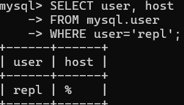

### 3.2. Xác định vị trí binary log

**Lệnh thực hiện trên Master:**

```sql
SHOW BINARY LOG STATUS\G
```

**Kết quả thực tế tại thời điểm cấu hình:**

```text
File: mysql-bin.000003
Position: 858
```

Hai giá trị này được sử dụng khi kết nối các Replica trong lần triển khai được ghi nhận.

**Minh chứng:** [`evidences/4.png`](evidences/4.png)

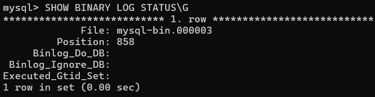

### 3.3. Kết nối Replica 1 và Replica 2 đến Master

**Truy cập từng Replica:**

```powershell
docker exec -it mysql-replica1 mysql -uroot -proot123
```

**Câu lệnh cấu hình (thực hiện trên từng Replica; lặp lại với `mysql-replica2`):**

```sql
STOP REPLICA;

CHANGE REPLICATION SOURCE TO
    SOURCE_HOST='mysql-master',
    SOURCE_PORT=3306,
    SOURCE_USER='repl',
    SOURCE_PASSWORD='Repl@123',
    SOURCE_LOG_FILE='mysql-bin.000003',
    SOURCE_LOG_POS=858,
    GET_SOURCE_PUBLIC_KEY=1;

START REPLICA;
SHOW REPLICA STATUS\G
```

**Kết quả trên cả hai Replica:**

```text
Source_Host: mysql-master
Source_User: repl
Replica_IO_Running: Yes
Replica_SQL_Running: Yes
Seconds_Behind_Source: 0
```

Không có lỗi ghi nhận trong `Last_IO_Error` và `Last_SQL_Error`. Kết quả còn được lưu nguyên trạng trong hai file [`replica1_status.txt`](evidences/replica1_status.txt) và [`replica2_status.txt`](evidences/replica2_status.txt).

**Minh chứng:**

- Replica 1: [`evidences/5.png`](evidences/5.png), [`evidences/6.png`](evidences/6.png).
- Replica 2: [`evidences/7.png`](evidences/7.png), [`evidences/8.png`](evidences/8.png).

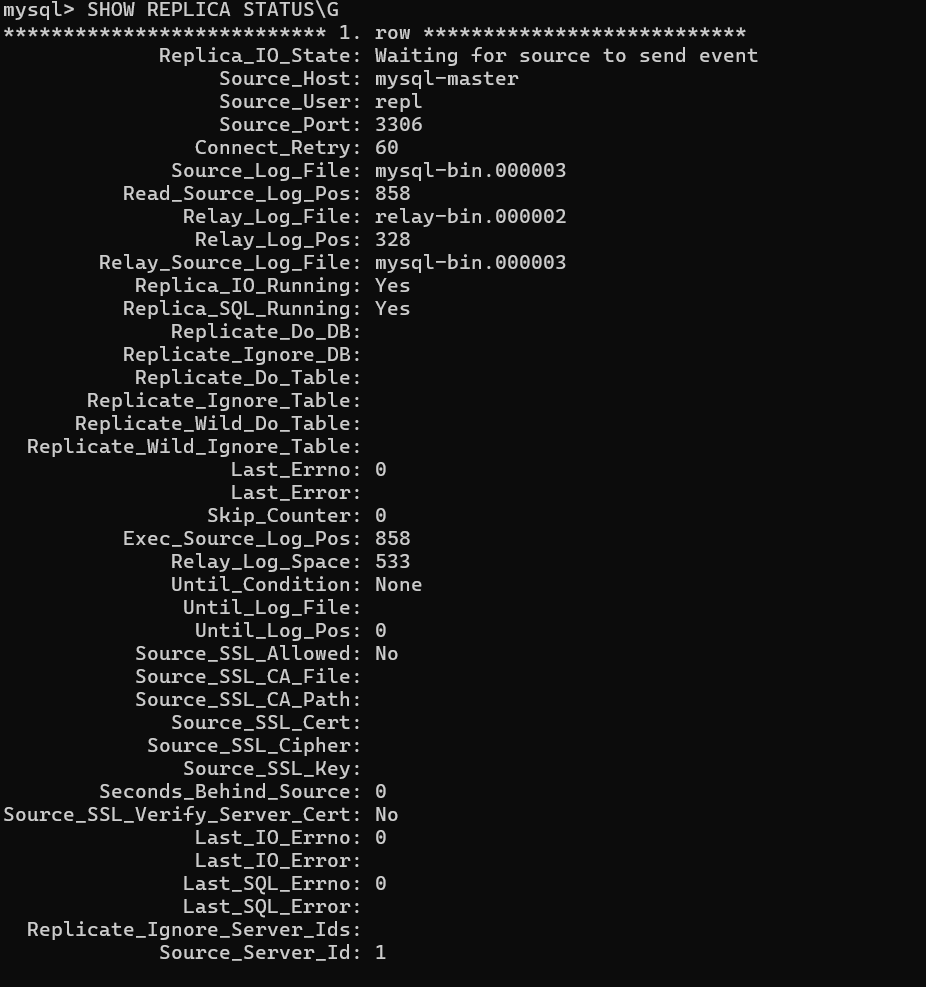

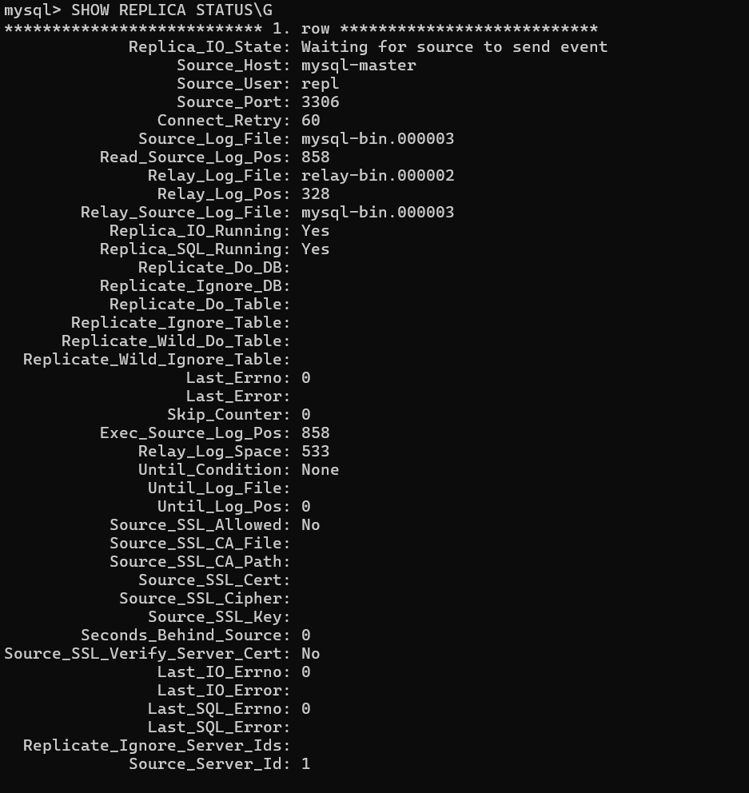

## 4. Khởi tạo CSDL quản lý sinh viên và kiểm tra đồng bộ DDL

**Các câu lệnh đã thực hiện trên Master:**

```sql
CREATE DATABASE qlsv;
USE qlsv;

CREATE TABLE SinhVien (
    MaSV VARCHAR(20) PRIMARY KEY,
    HoTen VARCHAR(100) NOT NULL,
    NgaySinh DATE
);

SHOW DATABASES;
SHOW TABLES;
```

**Kết quả:** Master có CSDL `qlsv` và bảng `SinhVien`. Lược đồ dùng cho bài thử được lưu trong [`sql/schema.sql`](sql/schema.sql).

**Minh chứng Master:** [`evidences/9.png`](evidences/9.png)

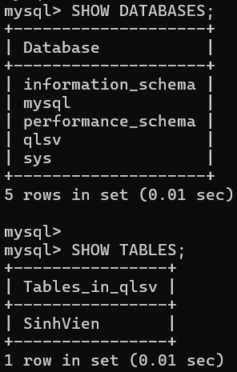

**Các lệnh kiểm tra trên hai Replica:**

```powershell
docker exec mysql-replica1 mysql -uroot -proot123 -e "SHOW DATABASES;"
docker exec mysql-replica1 mysql -uroot -proot123 -e "SHOW TABLES FROM qlsv;"

docker exec mysql-replica2 mysql -uroot -proot123 -e "SHOW DATABASES;"
docker exec mysql-replica2 mysql -uroot -proot123 -e "SHOW TABLES FROM qlsv;"
```

**Kết quả:** Cả hai Replica tự xuất hiện database `qlsv` và bảng `SinhVien` sau thao tác tạo trên Master. Như vậy, việc đồng bộ cấu trúc CSDL (DDL) được xác nhận.

**Minh chứng:** [`evidences/10.png`](evidences/10.png)

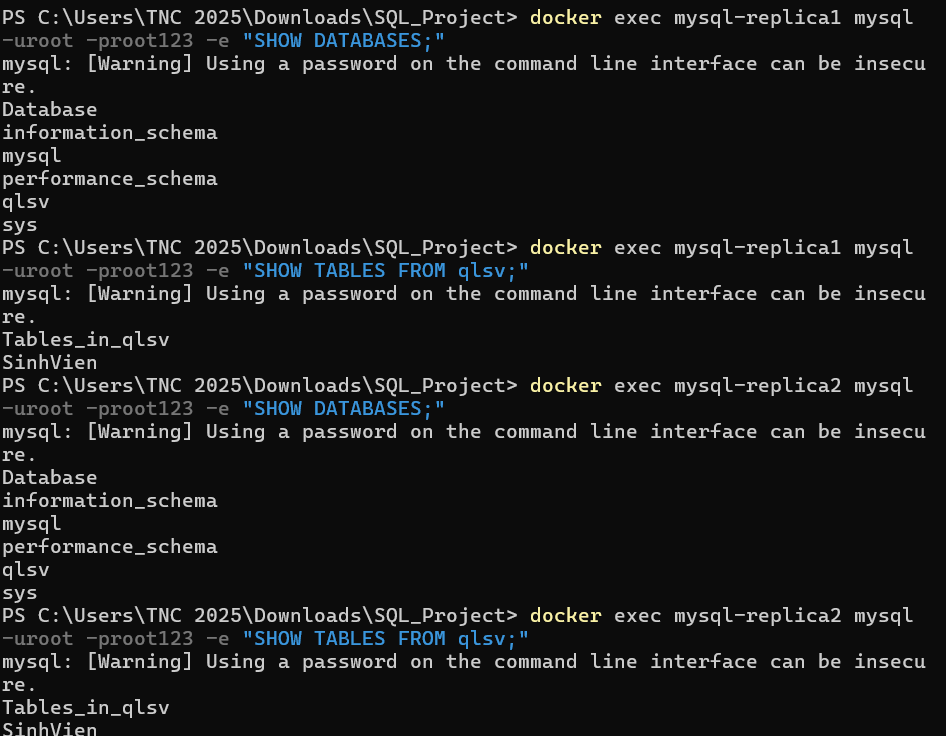

## 5. Thử nghiệm đồng bộ CRUD

Các thao tác ghi chỉ được thực hiện trên **Master**; kết quả được đối chiếu bằng `SELECT` trên Master và hai Replica.

### 5.1. INSERT — thêm một sinh viên

**Lệnh thực hiện:**

```powershell
docker exec mysql-master mysql -uroot -proot123 -e "INSERT INTO qlsv.SinhVien VALUES ('SV001','Nguyen Van An','2004-01-01');"

docker exec mysql-master mysql -uroot -proot123 -e "SELECT * FROM qlsv.SinhVien;"
docker exec mysql-replica1 mysql -uroot -proot123 -e "SELECT * FROM qlsv.SinhVien;"
docker exec mysql-replica2 mysql -uroot -proot123 -e "SELECT * FROM qlsv.SinhVien;"
```

**Kết quả trên cả ba node:**

| MaSV | HoTen | NgaySinh |
|---|---|---|
| SV001 | Nguyen Van An | 2004-01-01 |

**Minh chứng:** [`evidences/11.png`](evidences/11.png)

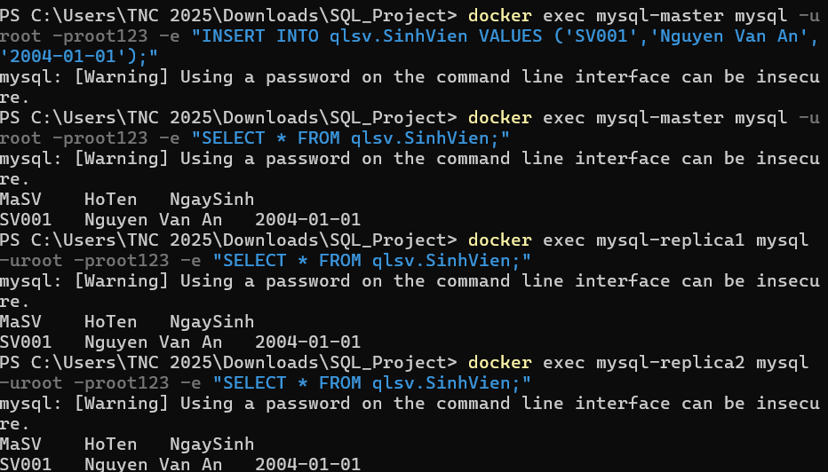

### 5.2. UPDATE — cập nhật thông tin sinh viên

**Lệnh thực hiện:**

```powershell
docker exec mysql-master mysql -uroot -proot123 -e "UPDATE qlsv.SinhVien SET HoTen='Nguyen Van An Updated' WHERE MaSV='SV001';"

docker exec mysql-master mysql -uroot -proot123 -e "SELECT * FROM qlsv.SinhVien WHERE MaSV='SV001';"
docker exec mysql-replica1 mysql -uroot -proot123 -e "SELECT * FROM qlsv.SinhVien WHERE MaSV='SV001';"
docker exec mysql-replica2 mysql -uroot -proot123 -e "SELECT * FROM qlsv.SinhVien WHERE MaSV='SV001';"
```

**Kết quả:** Trường `HoTen` của sinh viên `SV001` được thay đổi thành `Nguyen Van An Updated` trên cả Master, Replica 1 và Replica 2.

**Minh chứng:** [`evidences/12.png`](evidences/12.png)

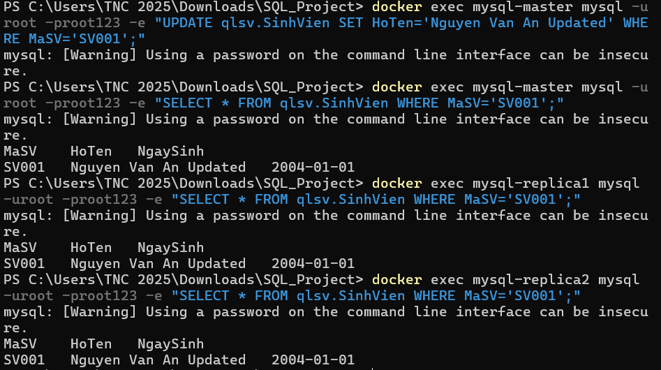

### 5.3. DELETE — xóa sinh viên

**Lệnh thực hiện:**

```powershell
docker exec mysql-master mysql -uroot -proot123 -e "DELETE FROM qlsv.SinhVien WHERE MaSV='SV001';"

docker exec mysql-master mysql -uroot -proot123 -e "SELECT * FROM qlsv.SinhVien;"
docker exec mysql-replica1 mysql -uroot -proot123 -e "SELECT * FROM qlsv.SinhVien;"
docker exec mysql-replica2 mysql -uroot -proot123 -e "SELECT * FROM qlsv.SinhVien;"
```

**Kết quả:** Bản ghi `SV001` không còn xuất hiện khi truy vấn ở cả ba node.

**Minh chứng:** [`evidences/13.png`](evidences/13.png)

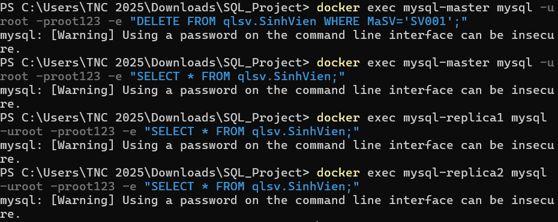

**Đánh giá CRUD:** Các thao tác thêm, sửa và xóa trên Master đều được hai Replica tiếp nhận và áp dụng thành công trong các trường hợp đã thử.

## 6. Thử nghiệm dừng Replica 1 và đồng bộ bù (catch-up)

### 6.1. Dừng replication trên Replica 1

**Lệnh thực hiện:**

```powershell
docker exec mysql-replica1 mysql -uroot -proot123 -e "STOP REPLICA;"
docker exec mysql-replica1 mysql -uroot -proot123 -e "SHOW REPLICA STATUS\G" | Select-String "Replica_IO_Running|Replica_SQL_Running"
```

**Kết quả:**

```text
Replica_IO_Running: No
Replica_SQL_Running: No
```

Đây là thử nghiệm **dừng luồng replication trên Replica 1**, không phải dừng Docker container.

**Minh chứng:** [`evidences/14.png`](evidences/14.png)

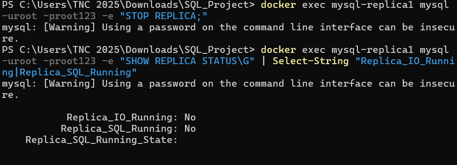

### 6.2. Ghi trên Master khi Replica 1 đang dừng

**Lệnh thực hiện:**

```powershell
docker exec mysql-master mysql -uroot -proot123 -e "INSERT INTO qlsv.SinhVien VALUES ('SV101','Sinh Vien Khi Replica Tat','2004-05-20');"

docker exec mysql-master mysql -uroot -proot123 -e "SELECT * FROM qlsv.SinhVien WHERE MaSV='SV101';"
docker exec mysql-replica1 mysql -uroot -proot123 -e "SELECT * FROM qlsv.SinhVien WHERE MaSV='SV101';"
docker exec mysql-replica2 mysql -uroot -proot123 -e "SELECT * FROM qlsv.SinhVien WHERE MaSV='SV101';"
```

**Kết quả:**

| Node | Có bản ghi `SV101`? |
|---|---|
| Master | Có |
| Replica 1 (đang dừng replication) | Không |
| Replica 2 (vẫn chạy replication) | Có |

**Minh chứng:** [`evidences/15.png`](evidences/15.png)

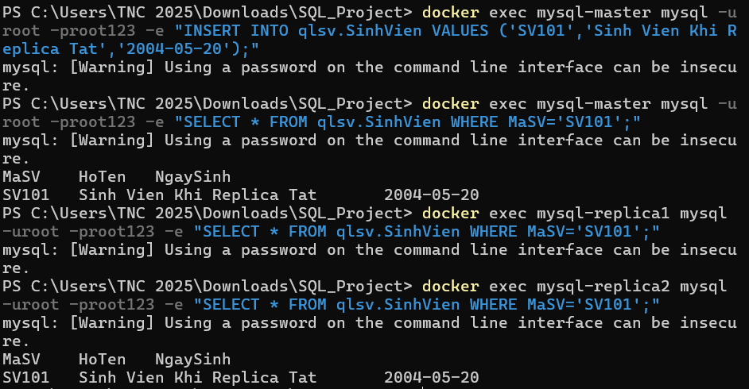

### 6.3. Khởi động lại Replica 1

**Lệnh thực hiện:**

```powershell
docker exec mysql-replica1 mysql -uroot -proot123 -e "START REPLICA;"
docker exec mysql-replica1 mysql -uroot -proot123 -e "SHOW REPLICA STATUS\G" | Select-String "Replica_IO_Running|Replica_SQL_Running|Seconds_Behind_Source"
docker exec mysql-replica1 mysql -uroot -proot123 -e "SELECT * FROM qlsv.SinhVien WHERE MaSV='SV101';"
```

**Kết quả:**

```text
Replica_IO_Running: Yes
Replica_SQL_Running: Yes
Seconds_Behind_Source: 0
```

Bản ghi `SV101` đã xuất hiện trên Replica 1 sau khi replication được khởi động lại. Thử nghiệm xác nhận khả năng nhận bù sự kiện chưa áp dụng trong thời gian tạm dừng.

**Minh chứng:** [`evidences/16.png`](evidences/16.png)

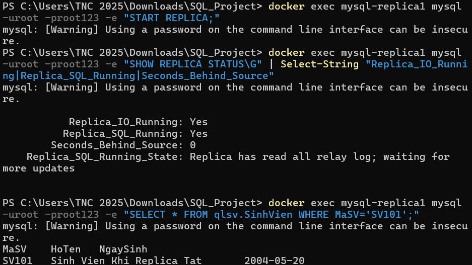

## 7. Sinh 10.000 bản ghi và kiểm tra dữ liệu tải lớn

### 7.1. Thực thi chương trình sinh dữ liệu

**Script:** [`scripts/generate_data.py`](scripts/generate_data.py). Chương trình sử dụng `Faker('vi_VN')` để tạo các bản ghi `MaSV`, `HoTen`, `NgaySinh`, với mã sinh viên dạng `FAKESV00001` đến `FAKESV10000`.

**Lệnh đã chạy:**

```powershell
python scripts/generate_data.py
```

**Kết quả được ghi trong ảnh:**

```text
DATA GENERATION
Inserted rows: 10000
Time elapsed: 0.6360395000001517 seconds
```

Thời gian trên là thời gian thực thi/chèn dữ liệu do script đo, không phải phép đo riêng cho độ trễ replication.

**Minh chứng:** [`evidences/17.png`](evidences/17.png)

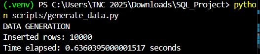

### 7.2. Đối chiếu số lượng bản ghi

**Các lệnh thực hiện:**

```powershell
docker exec mysql-master mysql -uroot -proot123 -e "SELECT COUNT(*) AS Total FROM qlsv.SinhVien;"
docker exec mysql-replica1 mysql -uroot -proot123 -e "SELECT COUNT(*) AS Total FROM qlsv.SinhVien;"
docker exec mysql-replica2 mysql -uroot -proot123 -e "SELECT COUNT(*) AS Total FROM qlsv.SinhVien;"
```

**Kết quả trong ảnh:**

| Node | `COUNT(*)` |
|---|---:|
| Master | 10.001 |
| Replica 1 | 10.001 |
| Replica 2 | 10.001 |

Tổng số bản ghi gồm 10.000 sinh viên vừa sinh và bản ghi `SV101` còn lưu sau thử nghiệm catch-up. Ba node có cùng số lượng bản ghi tại thời điểm kiểm tra.

**Minh chứng:** [`evidences/18.png`](evidences/18.png)

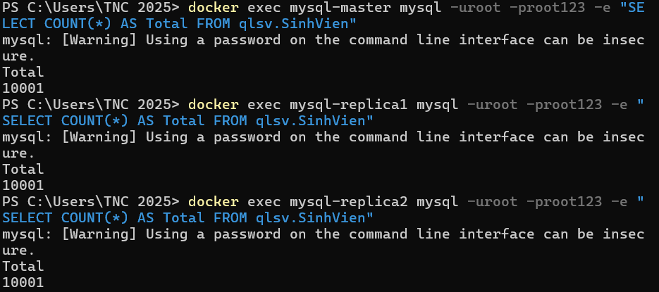

### 7.3. Đối chiếu giá trị một số bản ghi mẫu

**Các lệnh thực hiện:**

```powershell
docker exec mysql-master mysql -uroot -proot123 -e "SELECT * FROM qlsv.SinhVien WHERE MaSV IN ('FAKESV00001','FAKESV05000','FAKESV01000');"
docker exec mysql-replica1 mysql -uroot -proot123 -e "SELECT * FROM qlsv.SinhVien WHERE MaSV IN ('FAKESV00001','FAKESV05000','FAKESV01000');"
docker exec mysql-replica2 mysql -uroot -proot123 -e "SELECT * FROM qlsv.SinhVien WHERE MaSV IN ('FAKESV00001','FAKESV05000','FAKESV01000');"
```

**Kết quả:** Ba bản ghi mẫu có mã `FAKESV00001`, `FAKESV01000`, `FAKESV05000` được tìm thấy trên cả ba node với `HoTen`, `NgaySinh` trùng khớp. Kiểm tra này bổ sung bằng chứng về giá trị dữ liệu ngoài phép đếm số lượng.

**Minh chứng:** [`evidences/19.png`](evidences/19.png)

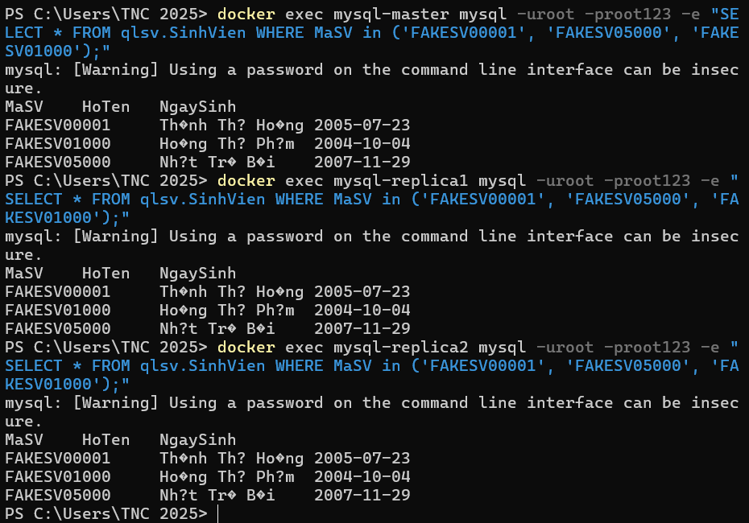

### 7.4. Trạng thái replication sau khi đồng bộ 10.000 bản ghi

**Các lệnh thực hiện:**

```powershell
docker exec mysql-replica1 mysql -uroot -proot123 -e "SHOW REPLICA STATUS\G" | Select-String "Replica_IO_Running|Replica_SQL_Running|Seconds_Behind_Source|Last_IO_Error|Last_SQL_Error"
docker exec mysql-replica2 mysql -uroot -proot123 -e "SHOW REPLICA STATUS\G" | Select-String "Replica_IO_Running|Replica_SQL_Running|Seconds_Behind_Source|Last_IO_Error|Last_SQL_Error"
```

**Kết quả trên cả hai Replica:**

```text
Replica_IO_Running: Yes
Replica_SQL_Running: Yes
Seconds_Behind_Source: 0
Last_IO_Error:
Last_SQL_Error:
```

**Minh chứng:** [`evidences/20.png`](evidences/20.png)

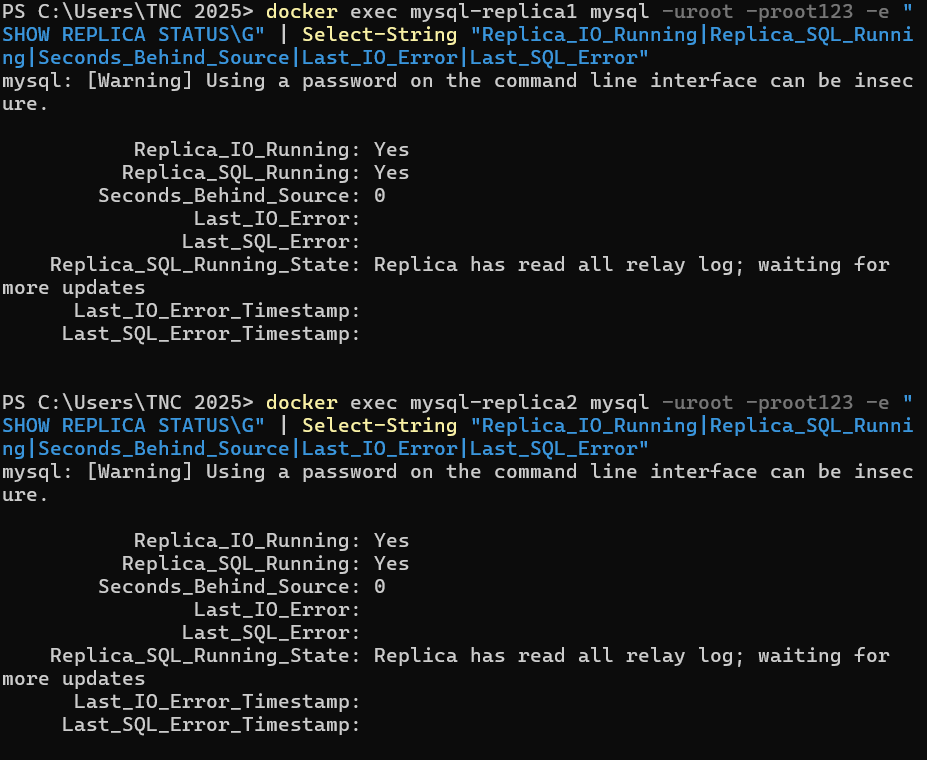

## 8. Đo độ trễ đồng bộ (replication latency)

**Script:** [`scripts/measure_latency.py`](scripts/measure_latency.py).

**Lệnh thực hiện:**

```powershell
python scripts/measure_latency.py
```

Script thực hiện **10 lần thử**: tạo một sinh viên mã `LAT_...` trên Master, sau đó truy vấn hai Replica để xác định thời gian bản ghi được nhìn thấy từ phía client. Thời gian được đo bằng milliseconds (ms).

### 8.1. Kết quả tại phiên chạy được chụp màn hình

| Chỉ số | Replica 1 | Replica 2 |
|---|---:|---:|
| Mẫu thành công | 10/10 | 10/10 |
| Trung bình | **18.557 ms** | **20.618 ms** |
| Trung vị | 18.128 ms | 20.128 ms |
| Nhỏ nhất | 17.558 ms | 19.674 ms |
| Lớn nhất | 21.057 ms | 23.231 ms |

**Minh chứng:** [`evidences/21.png`](evidences/21.png)

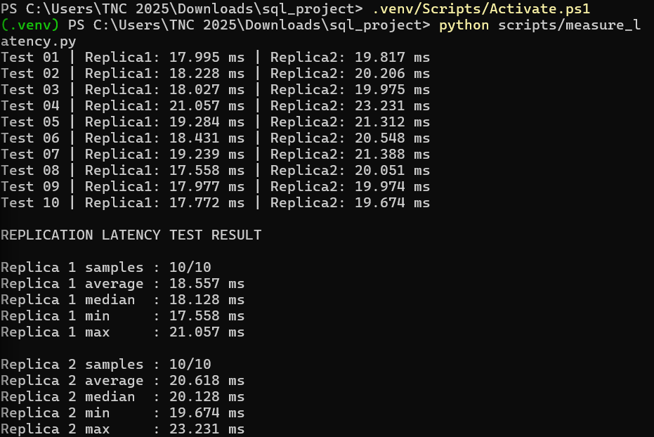

### 8.2. Kết quả của phiên chạy đã xuất ra file

File [`evidences/latency_result.txt`](evidences/latency_result.txt) lưu **một phiên chạy khác** của cùng script:

| Chỉ số | Replica 1 | Replica 2 |
|---|---:|---:|
| Mẫu thành công | 10/10 | 10/10 |
| Trung bình | **17.531 ms** | **19.598 ms** |
| Trung vị | 17.391 ms | 19.241 ms |
| Nhỏ nhất | 16.445 ms | 18.333 ms |
| Lớn nhất | 18.522 ms | 21.249 ms |

Hai bảng số liệu là **hai lần chạy riêng**; không gộp trị số của hai lần vào cùng một mẫu thống kê.

**Đánh giá:** Trong hai lần thử được lưu, mỗi Replica nhận thành công đủ 10/10 bản ghi. Metric được báo cáo là **độ trễ quan sát từ phía chương trình Python trong môi trường Docker local**; phép đo còn bao gồm chi phí query và polling, nên không phải độ trễ nội bộ thuần của MySQL. Do polling Replica 1 trước Replica 2, số liệu này chưa đủ để kết luận Replica 2 có hiệu năng replication thấp hơn.

## 9. Tổng hợp kết quả thực nghiệm

| Hạng mục | Lệnh / phương pháp kiểm tra | Kết quả ghi nhận | Minh chứng |
|---|---|---|---|
| Khởi chạy môi trường | `docker compose ps` | 3 container `Up` | [`1.png`](evidences/1.png) |
| Cấu hình từng node | `SELECT @@server_id, @@log_bin` | IDs `1/2/3`, log bin `1/1/1` | [`2.png`](evidences/2.png) |
| Tài khoản replication | `SELECT user, host FROM mysql.user` | `repl@%` | [`3.png`](evidences/3.png) |
| Binary log | `SHOW BINARY LOG STATUS` | `mysql-bin.000003`, position `858` | [`4.png`](evidences/4.png) |
| Kết nối hai Replica | `SHOW REPLICA STATUS` | IO/SQL: `Yes/Yes` | [`5–8.png`](evidences/5.png) |
| Đồng bộ cấu trúc CSDL | `SHOW DATABASES`, `SHOW TABLES` | `qlsv.SinhVien` tồn tại ở 3 node | [`9.png`](evidences/9.png), [`10.png`](evidences/10.png) |
| INSERT | `INSERT` và `SELECT` | Bản ghi `SV001` có ở 3 node | [`11.png`](evidences/11.png) |
| UPDATE | `UPDATE` và `SELECT` | Tên `SV001` đồng bộ | [`12.png`](evidences/12.png) |
| DELETE | `DELETE` và `SELECT` | `SV001` không còn ở 3 node | [`13.png`](evidences/13.png) |
| Dừng Replica 1 | `STOP REPLICA` | IO/SQL: `No/No` | [`14.png`](evidences/14.png) |
| Ghi khi Replica 1 dừng | `INSERT SV101` và `SELECT` | Master/Replica 2 có, Replica 1 chưa có | [`15.png`](evidences/15.png) |
| Đồng bộ bù | `START REPLICA` và `SELECT` | Replica 1 nhận `SV101`, IO/SQL `Yes/Yes` | [`16.png`](evidences/16.png) |
| Sinh dữ liệu giả lập | `python scripts/generate_data.py` | Chèn 10.000 bản ghi | [`17.png`](evidences/17.png) |
| Kiểm tra số lượng | `COUNT(*)` | `10001/10001/10001` | [`18.png`](evidences/18.png) |
| Đối chiếu bản ghi | `SELECT ... WHERE MaSV IN (...)` | Ba bản ghi mẫu trùng khớp | [`19.png`](evidences/19.png) |
| Trạng thái sau tải lớn | `SHOW REPLICA STATUS` | `Yes/Yes`, lag báo cáo `0` | [`20.png`](evidences/20.png) |
| Độ trễ đồng bộ | `python scripts/measure_latency.py` | 10/10 ở cả hai Replica | [`21.png`](evidences/21.png), [`latency_result.txt`](evidences/latency_result.txt) |

### Hồ sơ kết quả và log kèm theo

- [`evidences/1.png` đến `evidences/21.png`](evidences/): ảnh lệnh và kết quả tại từng bước thử nghiệm.
- [`evidences/replica1_status.txt`](evidences/replica1_status.txt), [`evidences/replica2_status.txt`](evidences/replica2_status.txt): chi tiết trạng thái replication được xuất từ MySQL.
- [`evidences/latency_result.txt`](evidences/latency_result.txt): số liệu đo latency của phiên chạy lưu ra file.
- [`evidences/master.log`](evidences/master.log), [`evidences/replica1.log`](evidences/replica1.log), [`evidences/replica2.log`](evidences/replica2.log): nhật ký Docker/MySQL của ba node.

## 10. Kết luận

Trong phạm vi bài thực hành, đã triển khai thành công **1 MySQL Master và 2 Replicas** bằng Docker; cấu trúc bảng và các thay đổi INSERT/UPDATE/DELETE trên Master được đồng bộ sang hai Replica. Khi dừng replication trên Replica 1, Master vẫn tiếp tục ghi và Replica 2 vẫn tiếp nhận thay đổi; sau khi chạy lại, Replica 1 nhận bù bản ghi bị thiếu. Thử nghiệm tải lớn tạo **10.000 bản ghi**, và phép kiểm tra tại thời điểm chụp cho thấy cả ba node cùng có **10.001 bản ghi**. Hai phiên đo latency được lưu đều đạt **10/10 lượt nhận dữ liệu thành công** trên mỗi Replica.

Những kết quả này đáp ứng phần **thiết lập, kiểm thử đồng bộ, mô phỏng mất kết nối, sinh dữ liệu và đo độ trễ** của bài thực hành Master–Slave Replication được phân công. Kết quả không nhằm chứng minh tính sẵn sàng cao tự động (automatic failover) hoặc hiệu năng Cluster; đó là nội dung thử nghiệm khác với replication một Master–hai Replica.
